# 🚀 CICD Pipeline for Containerized Web Application Using Jenkins & Docker

## 📌 Project Description

This project demonstrates a complete **CI/CD pipeline using Jenkins and Docker** to automate the build, push, and deployment of a containerized web application.

The pipeline is implemented using a **Jenkinsfile (Pipeline as Code)** and follows real-world DevOps practices.

---

## 🏗️ Architecture

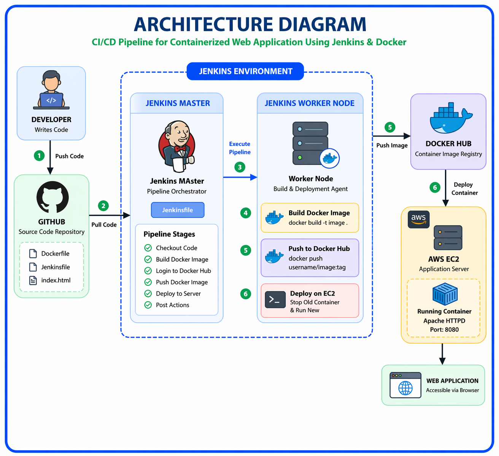

---

## ⚙️ Technologies Used

* Jenkins (Declarative Pipeline)
* Docker
* Docker Hub
* GitHub
* AWS EC2
* Apache HTTP Server

---

## 🔄 Workflow

1. Developer pushes code to GitHub
2. Jenkins pulls code from repository
3. Jenkins executes pipeline on worker node
4. Docker image is built
5. Image is pushed to Docker Hub
6. Existing container is removed
7. New container is deployed
8. Application becomes live

---

## 📂 Project Structure

```id="realstruct01"
docker-jenkins-cicd/
│
├── Dockerfile
├── Jenkinsfile
├── index.html
├── README.md
|
├── architecture/
│ └── architecture-diagram.png
|
├── project-docs/
│   └── CICD Pipeline for Containerized Web Application Using Jenkins & Docker.pdf
│
└── screenshots/
```

---

## 🧪 Pipeline Stages

* Checkout Code
* Build Docker Image
* Login to Docker Hub
* Push Image
* Deploy Container
* Post Actions

---

## 📸 Project Execution

### 🔹 GitHub Repository

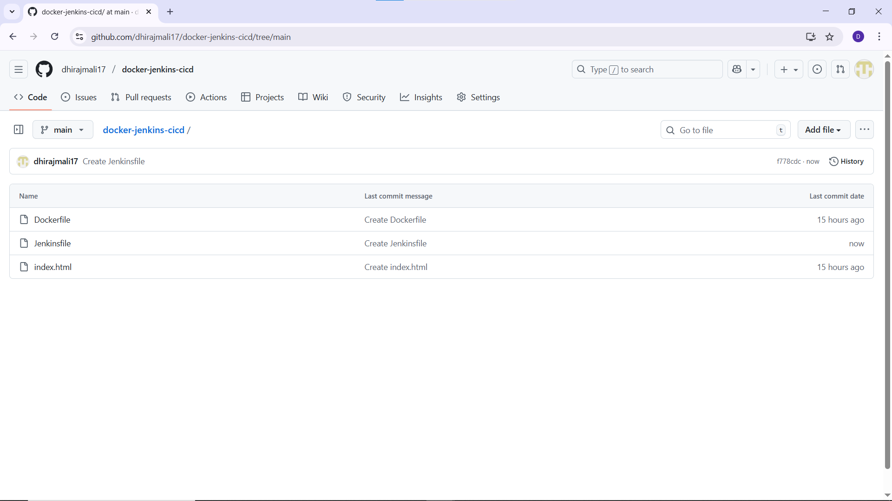

### 🔹 Jenkins Job Creation

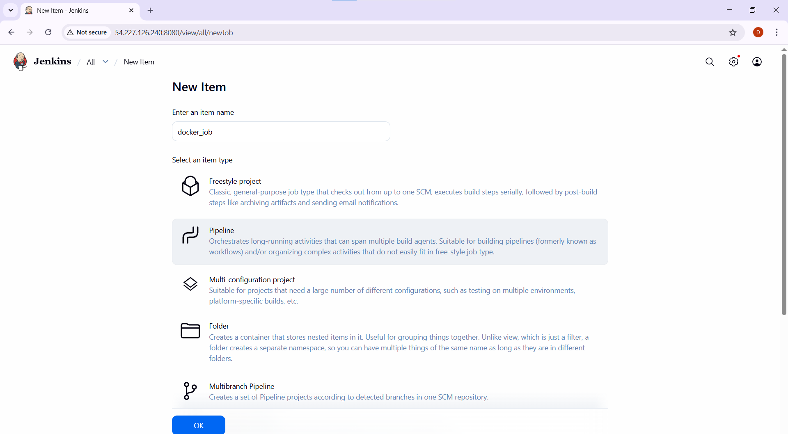

### 🔹 Pipeline Configuration

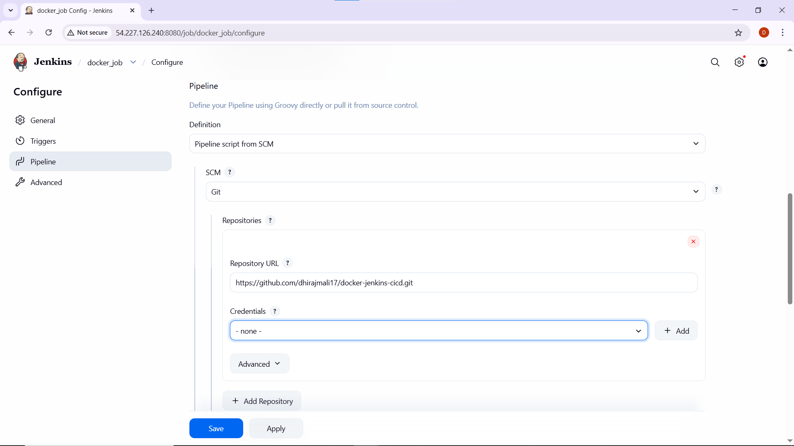

### 🔹 Branch Configuration

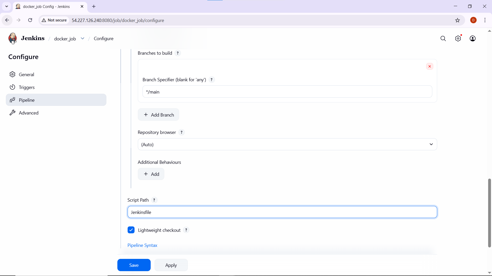

### 🔹 Successful Pipeline Execution

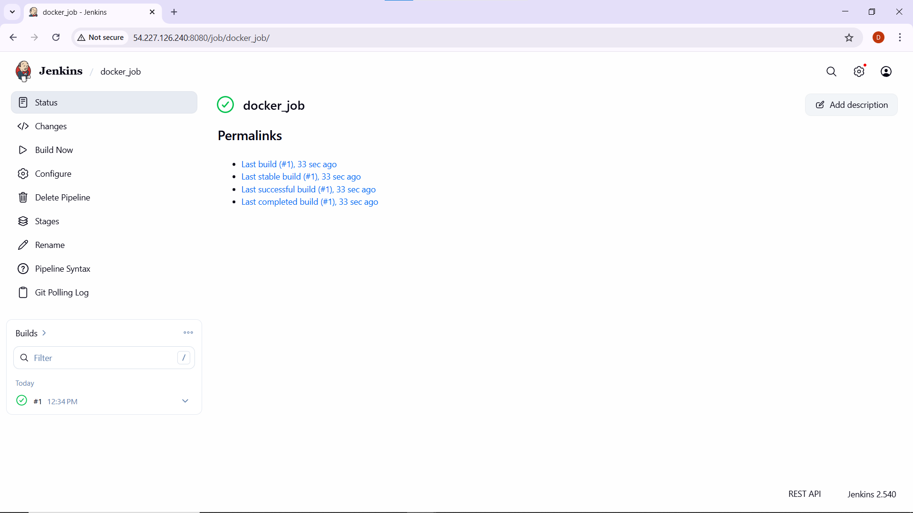

### 🔹 Pipeline Stage View

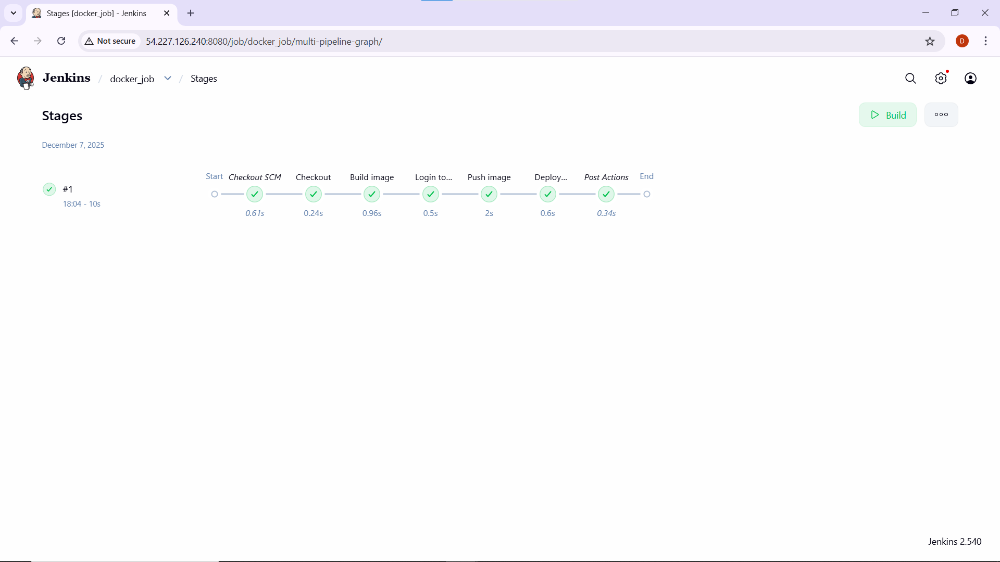

### 🔹 Pipeline Overview

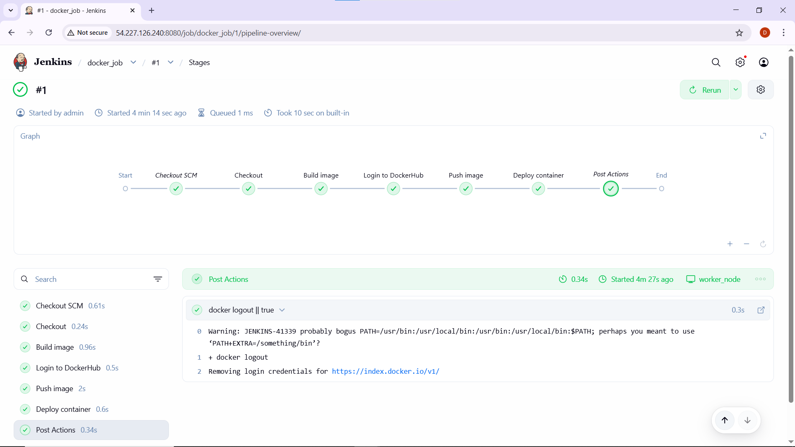

### 🔹 Detailed Pipeline Steps

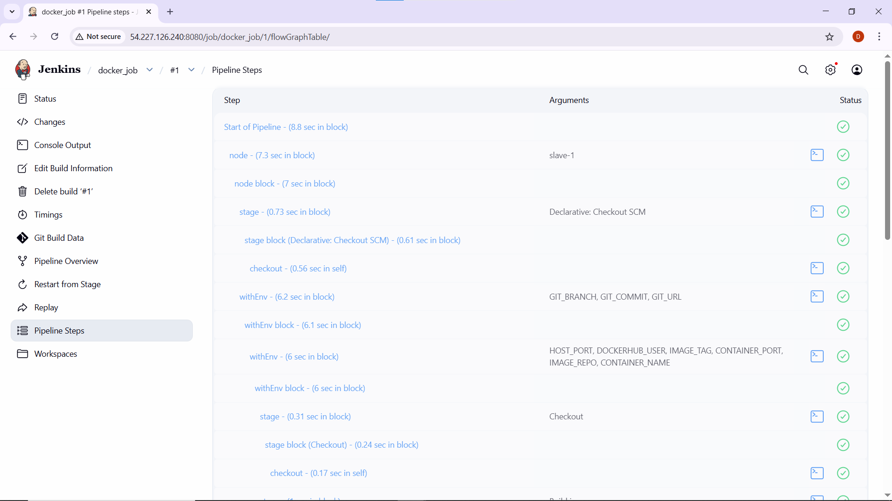

### 🔹 Docker Hub Image

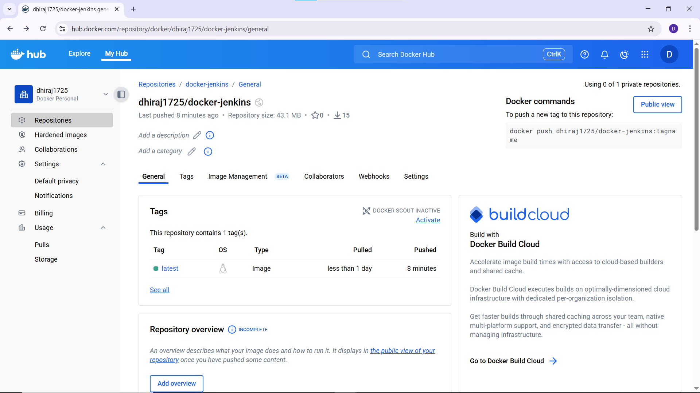

### 🔹 Running Container

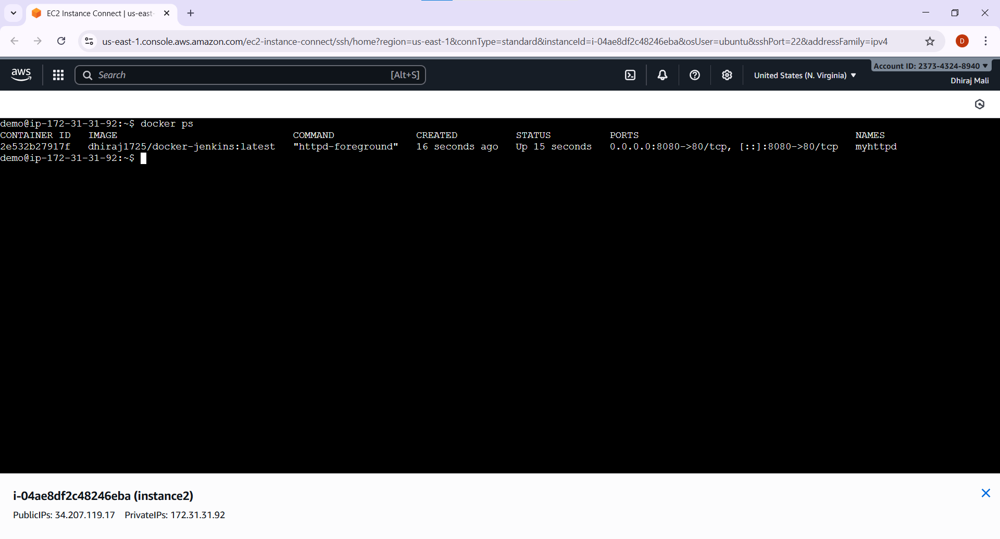

### 🔹 Web Application Output

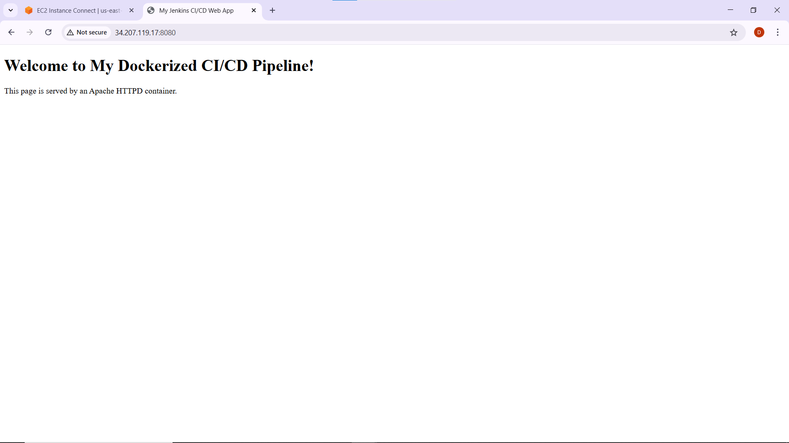

---

## 🚀 How to Run

### 1. Clone Repository

```bash id="clone02"
git clone https://github.com/dhirajmali17/docker-jenkins-cicd.git
```

### 2. Jenkins Setup

* Install Jenkins
* Install required plugins (Pipeline, Git)
* Configure Jenkins worker node
* Install Docker on worker node

### 3. Add Credentials

* Add Docker Hub credentials in Jenkins
  (Username + Access Token)

### 4. Create Pipeline Job

* Select **Pipeline**
* Choose **Pipeline script from SCM**
* Add GitHub repo URL
* Script path: `Jenkinsfile`

### 5. Run Pipeline

* Click **Build Now**
* Monitor stages

---

## 🌐 Application Access

```id="url02"
The application was successfully deployed on an AWS EC2 instance during testing.

Example access format:
http://<EC2-PUBLIC-IP>:8080
```

---

## 🎯 Key Features

* Fully automated CI/CD pipeline
* Jenkins multi-node setup
* Docker image automation
* Zero manual deployment
* Pipeline as Code

---

## 📚 Learning Outcomes

* Jenkins Pipeline (Declarative)
* Docker build & push process
* CI/CD automation
* Real-world DevOps workflow

---

## 📌 Conclusion

This project demonstrates a complete automated CI/CD pipeline that builds, pushes, and deploys a containerized application using Jenkins and Docker.

---

## 👨‍💻 Author

**Dhiraj Mali**
DevOps Enthusiast
